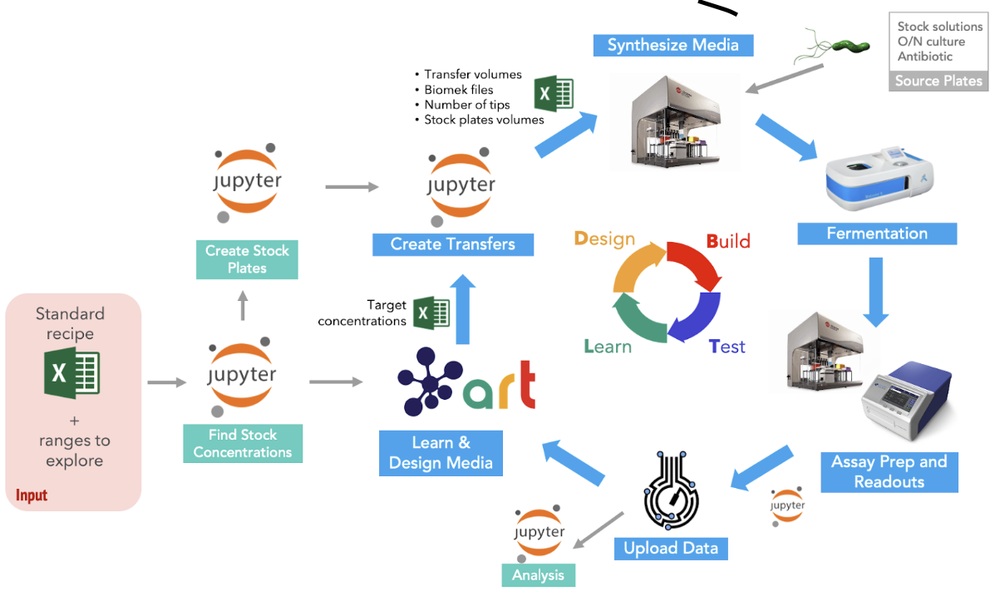

This repository includes the notebooks and data for campaign 2 of the paper "Machine learning-led semi-automated medium optimization reveals salt as key for flaviolin production in Pseudomonas putida". This was the second campaign we performed for titer maximization

We performed 6 DBTL cycles.

The notebooks "DBTL0_A_Find_Stock_Concentrations.ipynb" and "DBTL0_B_Create_Stock_Plates.ipynb" must be ran before any experimental work is done, in preparation for the campaign.

Each DBTL cycle requires 4 notebooks:

DBTLX_C_ART_Media_designs.ipynb: Gets data from EDD for the previous DBTL cycles, trains the probabilistic model of ART and generates recommendations for media designs for this DBTL cycle DBTLX_D_Create_Transfers.ipynb: Gets the recommended media designs, stock concentrations and stock plates (created by notebooks A and B) and generates the instructions for a Biomek NX-S8 liquid handler. DBTLX_E_Create_EDD_Study_Files.ipynb: After the experiment is complete, gets the experimental data of OD340 and OD600 and creates the 3 files required for a streamlined upload of these data to EDD DBTLX_F_Analysis.ipynb: Gets the data from EDD and performs statistical calculations and visualizations

The first 2 DBTL cycles contain media designs generated using Latin Hypercube Sampling. This was done in the notebook "DBTL1_2_Initial_Media_Designs.ipynb", which replaces the notebooks "DBTL1_C_ART_Media_designs.ipynb" and "DBTL2_C_ART_Media_designs.ipynb"

A schematic of the process is shown in the next figure:

In the folder "benchmark runs" we have included comparisons between ART using parallel tempering, ART using differential evolution, gpCAM, and JMP

